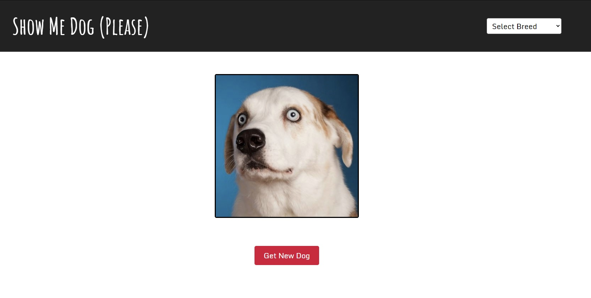

# show-me-dog

Learning how to fetch data from APIs with, obviously, dogs :)

Currently live at https://gordonwoodbine.github.io/show-me-dog/

Still to do:

- [ ] Add footer to page
- [ ] Test browser compatability
